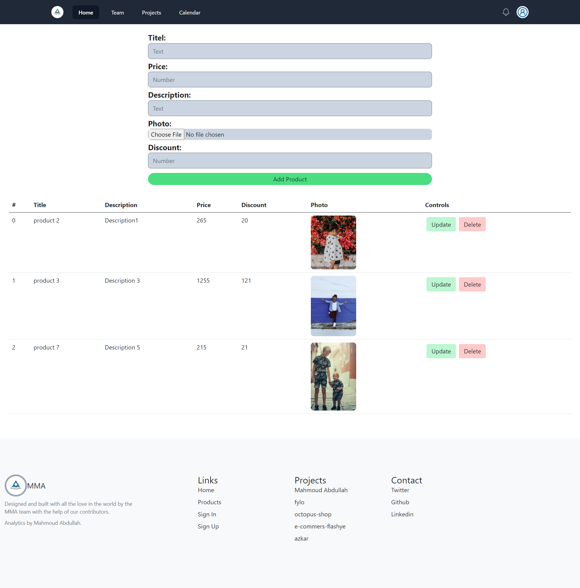
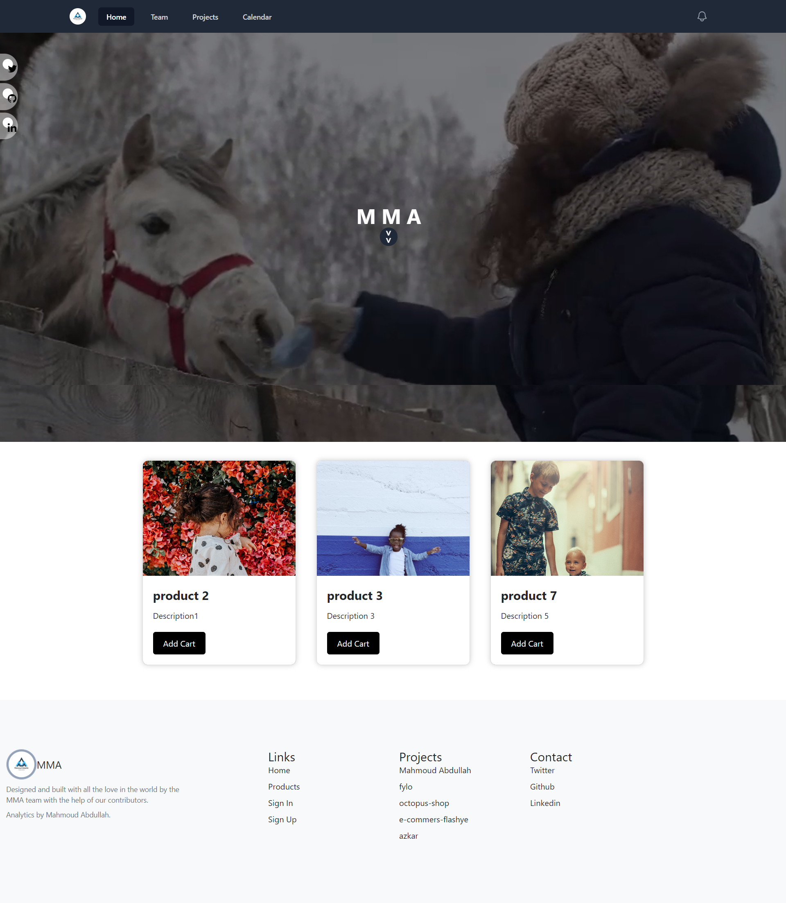
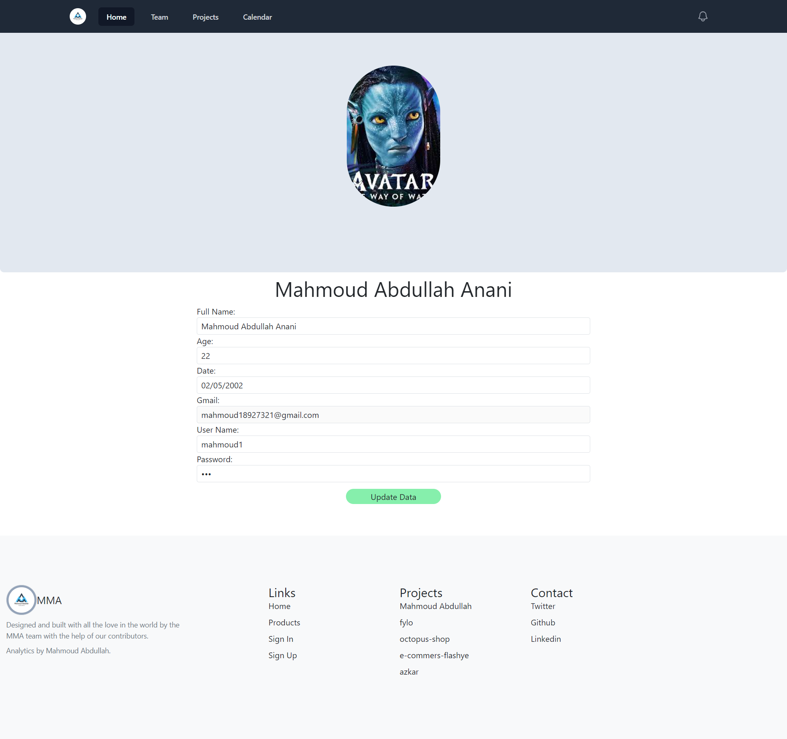

<h1>MMA</h1>
<h6>It is an application that manages the products of a commercial store that publishes its products electronically with some other powerful features.</h6>

<h1>Application features✨✨:</h1>
<ul>
    <li>Sign In & Sign Up.</li>
    <li>Sign In Admin & Sign Up Admin.</li>
    <li>Dashboard.</li>
    <li>Page Account Setting.</li>
    <li>Home Page [ View Products ].</li>
    <li>CRUD Operations.</li>
</ul>

<h1>software used</h1>
<ul>
    <li>php.</li>
    <li>js.</li>
    <li>mySql.</li>
    <li>tailwindcss.</li>
    <li>Bootstrap.</li>
    <li>html & css.</li>
    <li>sass.</li>
    <li>php oop & mysqli.</li>
</ul>
<table>
  <thead>
    <tr>
      <th>Login</th>
      <th>SignUp</th>
      <th>Dashboard</th>
      <th>Home Page</th>
      <th>Page Account Setting</th>
    </tr>
  </thead>
  <tbody>
    <tr>
      <th width="600px"></th>
      <th width="600px"></th>
      <th width="600px"></th>
      <th width="600px"></th>
      <th width="600px"></th>
    </tr>
  </tbody>
  <tfoot>
    <tr>
      <th>Login</th>
      <th>SignUp</th>
      <th>Dashboard</th>
      <th>Home Page</th>
      <th>Page Account Setting</th>
    </tr>
  </tfoot>
</table>
